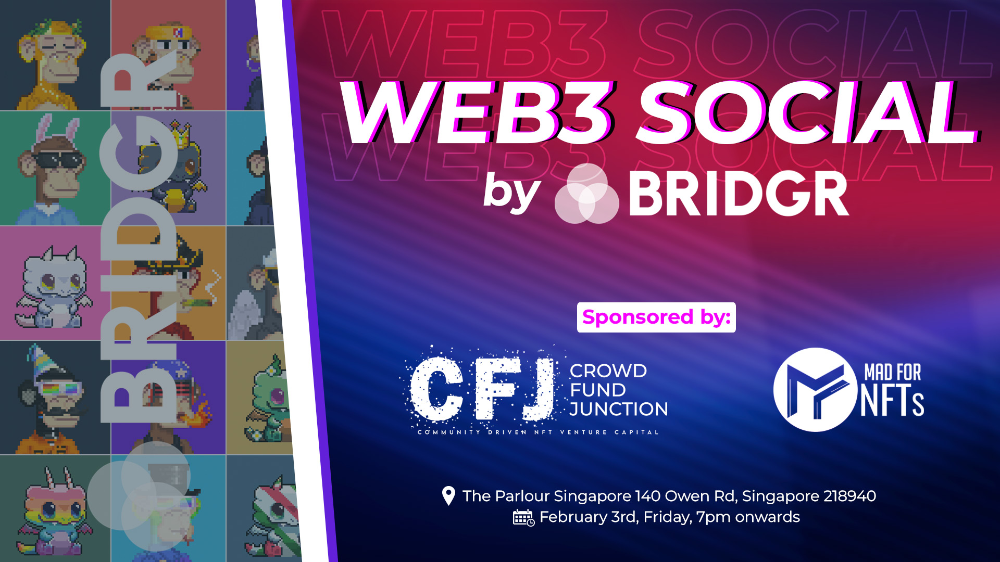

# Increased Visibility

## What’s the general idea?

Ethlas has built game infrastructure, which allows cross community competitions (e.g. Battle Showdown). The general idea is to offer free Battle Showdown integration for all partners. Perhaps we could also offer BRIDGR’s community perks within Ethlas’ ecosystem?

## Who’s the target group?

* Alpha Partners and Core Partners
* (Perhaps BRIDGR’s community)

## Who contributes to building this?

* Ethlas is lead

## What’s the delivery platform?

* A dedicated channel for each partner in BRIDGR’s token gated discord where they can get integration support from Ethlas&#x20;

## Outstanding matters?

* How many Core Partners can Ethlas integrate?
* What is the selection criteria?
* Can Ethlas offer perks for BRIDGR’s community?

## WEB3 SOCIAL Events

<figure><figcaption></figcaption></figure>

## Value proposition for friends and partners

* Networking with fellow Web3 professionals
* Free POAP NFT
* Free drinks
* Social media exposure

\
