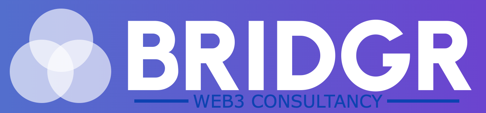

# BRIDGR Consultancy Services

<figure><figcaption></figcaption></figure>

## Advice and Consultation service to onboard Web2 companies

When there is too much work to handle, we hire consultants and scale that way.

In-house 

All these services can be done in-house by BRIDGR.&#x20;

## NFTS:

* Which blockchain is best for your project (i.e. Ethereum/Flow/Solana/ Tezos)?
* Which marketplace to use for launch? (i.e. Opensea, Magic Eden, SuperRare or a Custom build)
* Amount of NFTS and pricing
* Methods of sale (auction, fixed price, a reserve etc)
* Adding Utility and Unlockable Content

## Web3:

* Consultancy on company/brand utilisation of the blockchain and Web3 technology
* Guidance and exploration of NFTs into your current business model
* Discovery and analysis for future revenue streams using Web3
* Expanding and developing your current Web3 offerings
* Marketing advice

## Exposure & Advertising:

* IRL events exposure (they pay towards sponsorship and get graphics)
* Collective social media exposure from worldwide Alpha Partners
* News article published and spread among alpha partners
* Network access - RTs on Twitter and Linkedin
* Community access
* Education
* Twitter spaces & Discord AMAs.
* Whitelists
* Influencers that align with the customer via Mad for NFTs
* more?

## Technical Services:

* Discord builds: Bots, security, layout & finding moderators. (chatters potentially too)
* Staking, Tokenomics & Web3 gaming consultation

Out sourced

## Technical Support&#x20;

Potentially done semi in-house by Jokong and Kolsas if the pay is good enough. Else subcontract.

* Smart Contract builds
* Smart Contract audit&#x20;
* Website build + Web3 Integration

<!---->

* ERC20 token creation and deployment
* ERC1155 Editions NFT contract creation and deployment
* ERC 721 NFT drops with full website integration

USP: Post-consultancy perks

All consultancy customers get onboarded as a "Friend of BRIDGR' for free.

The consultancy acts as a sales pipeline for the rest of BRIDGR's services, making conversion into a paid partner easier.

## Network Access

## Community Access

## Metaverse & Game Integration

## Education

## Legal

