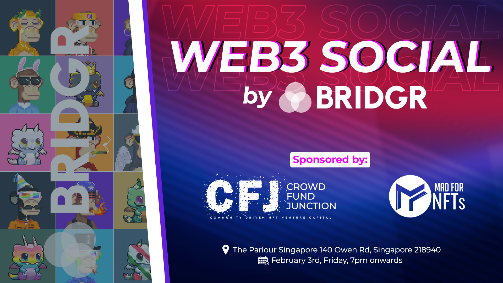

# WEB3 SOCIAL

<figure><figcaption></figcaption></figure>

## Value proposition for partners

* Networking with fellow Web3 enthusiasts
* Free POAP
* Free beer
* Social media competitions

## Value proposition for Alpha Partners

* Exposure & visibility towards new audiences
* Onboarding of new community members
* Content for social media posts

## Sponsorship

* CrowdFundJunction & MadForNFTs has committed to securing sponsorships for all events in 2023.
* Sponsorships from CrowdFundJunction & MadForNFTs are capped at SGD 500 per event.
* Events with larger budgets require external sponsorships.

## Locations

The frequency of events is every 4-8 weeks depending on how established the local community is.&#x20;

* Singapore - established ✅
* Bali (Denpasar) - under development ✅
* Vietnam (Hanoi) - under development ✅
* Turkey (Istanbul) - established ✅
* Korea (Seoul) - under development ⏳
* UK (London) - under development ⏳
* UK (Manchester) - under development ⏳
* France (Lyon) - under development ⏳
* Germany (Berlin) - under development ⏳
* US (Boston) - under development ❓
* US (New York) - under development ❓
* US (Chicago) - under development ❓
